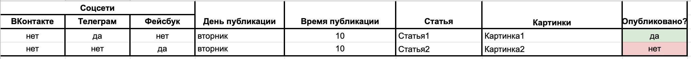

### ПУБЛИКАЦИЯ ОТЛОЖЕННЫХ ПОСТОВ В СОЦИАЛЬНЫХ СЕТЯХ (SMMplanner)

Скрипт предназначен для автоматической публикации постов в нескольких социальных сетях, на основании расписания, заданного в Google таблице. Скрипт способен публиковать посты в группе на сайте [ВКонтакте](https://vk.com), на канале в Telegram, и в группе на сайте [facebook](https://www.facebook.com). Текст поста и изображение скрипт берет из Google таблицы. Формат таблицы следующий: 


Запускают скрипт со следующим необязательными параметрами:
1. ```-s SLEEP, --sleep```      Пауза между опросами Google таблицы в секундах. По умолчанию 300 секунд.
2. ```-l LOG, --log```          Путь к каталогу с log файлом.

```
python.exe main.py -s 300 -l logs
```	
В скрипте инициализируются следующие переменные окружения:
- `SPREADSHEET_ID` - ID Google таблицы. Значение из ссылки на google таблицу.
- `RANGE_NAME` - диапазон ячеек с расписанием публикаций в формате `A3:H14`.
- `VK_ACCESS_TOKEN` - переменная в которой хранится секретный токен, необходимый для подключения к api сайта [vk.com](http://www.vk.com). Для получения секретного токена рекомендуется использовать процедуру  [Implicit Flow](https://vk.com/dev/implicit_flow_user).
- `TELEGRAM_ACCESS_TOKEN` - переменная в которой хранится секретный токен бота, специально созданного для публикации сообщений на канале [telegram](https://core.telegram.org/bots/api).
- `FACEBOOK_ACCESS_TOKEN` - переменная в которой хранится маркер доступа, необходимый для подключения к api сайта [facebook.com](https://www.facebook.com). Маркер доступа рекомендуется получить с помощью [Graph API Explorer](https://developers.facebook.com/docs/graph-api/explorer/). 
- `VK_GROUP_ID` - уникальный ключ группы, в которой скрипт будет формировать посты. Для получения ID группы используйте сервис [regvk.com](https://regvk.com/id/).
- `VK_ALBUM_ID` - уникальный ключ альбома, в который скрипт будет помещать загруженные фотографии. 
- `TELEGRAM_CHAT_ID` - имя вашего канала в telegram, в который скрипт будет отправлять сообщения.
- `FACEBOOK_GROUP_ID` - уникальный ключ группы, в которой скрипт будет формировать посты. Для получения ID группы используйте [Graph API Explorer](https://developers.facebook.com/docs/graph-api/explorer/).
- `TELEGRAM_PROXIES` - адрес прокси сервера по протоколу socks4/5, необходимый для обхода блокировки Telegram в России.
Переменные инициализируются значениями заданными в .env файле.

Перед запуском скрипта заполните расписание публикаций в google таблице, а так же привязать ссылки на файлы с текстом постов и картинками на google диске. Ознакомится с требованиями к публикуемым изображениям можно в документации, соответствующих социальных сетей.


Информацию о ходе выполнения скрипт пишет в файл log.txt, который, по умолчанию, будет создан в корневой папке, если не указан иной каталог в соответствующем аргументе скрипта. Результат публикации отражается в колонке "Опубликовано" в google таблице. 

#### КАК УСТАНОВИТЬ

Для установки отредактируйте файл .env, в котором заполнить `SPREADSHEET_ID`,`RANGE_NAME`, `VK_ACCESS_TOKEN`, `TELEGRAM_ACCESS_TOKEN`, `FACEBOOK_ACCESS_TOKEN`, `VK_GROUP_ID`, `VK_ALBUM_ID`, `TELEGRAM_CHAT_ID`, `FACEBOOK_GROUP_ID`, `TELEGRAM_PROXIES`.

Так же в корневую папку скрипта положите следующие файлы:
1. `credentials.json` - файл с параметрами авторизации [Google Sheets API](https://developers.google.com/sheets/api/quickstart/python).
2. `client_secrets.json` - файл с информацией о аутентификации приложения [Google Drive](https://gsuitedevs.github.io/PyDrive/docs/build/html/quickstart.html#authentication).

Python3 должен быть уже установлен. Затем используйте pip (или pip3, если есть конфликт с Python2) для установки зависимостей:

```
pip install -r requirements.txt
```

#### ЦЕЛЬ ПРОЕКТА

Код написан в образовательных целях, для изучения возможностей api, на онлайн-курсе для веб-разработчиков [dvmn.org](https://dvmn.org).
